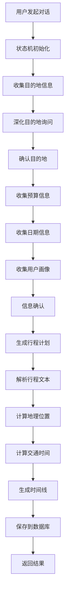
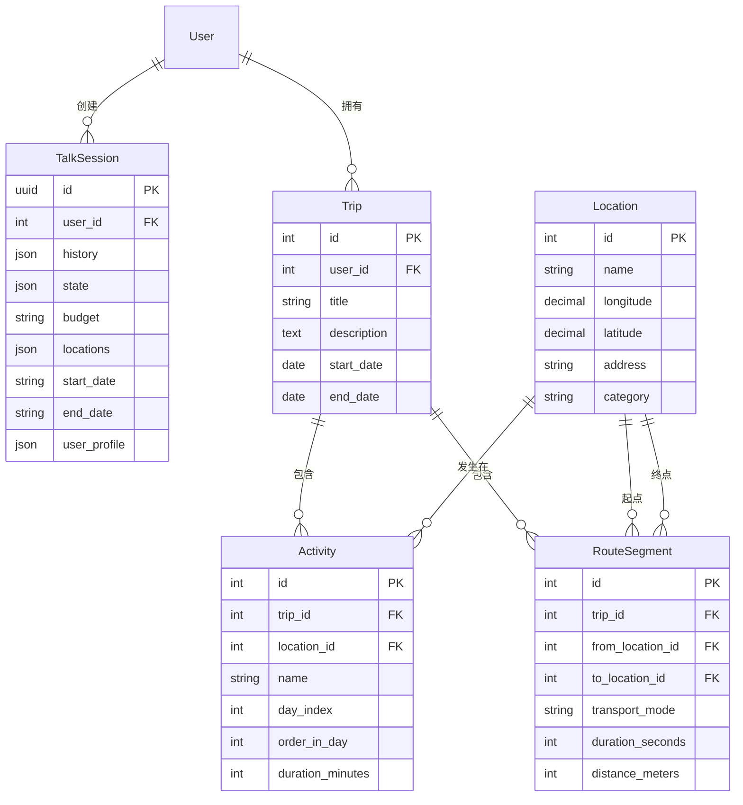
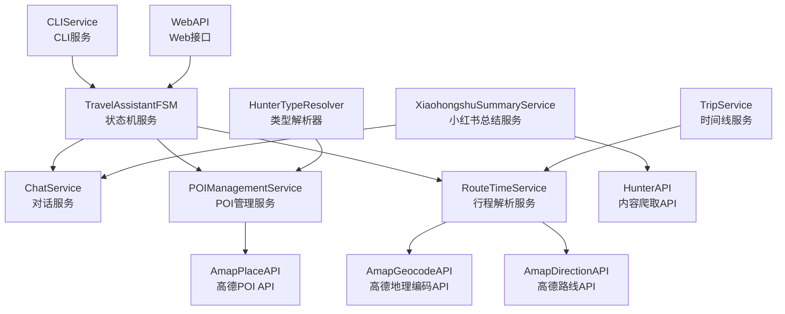

# 行程线业务流程详细文档

## 目录

1. [业务概述](#1-业务概述)
2. [整体架构](#2-整体架构)
3. [状态机设计](#3-状态机设计)
4. [槽位填充流程](#4-槽位填充流程)
5. [Prompt设计](#5-prompt设计)
6. [行程解析引擎](#6-行程解析引擎)
7. [时间线生成](#7-时间线生成)
8. [数据库设计](#8-数据库设计)
9. [数据结构详解](#9-数据结构详解)
10. [服务类架构](#10-服务类架构)
11. [API接口](#11-api接口)
12. [错误处理](#12-错误处理)

---

## 1. 业务概述

### 1.1 核心功能

旅行助手系统通过对话式交互，帮助用户完成个性化旅行计划的制定，从槽位信息收集到最终生成可执行的行程时间线。

### 1.2 主要特性

- **智能对话**：基于状态机的多轮对话，自然收集用户需求
- **槽位填充**：目的地、预算、日期、用户画像四大核心槽位
- **行程解析**：自动解析AI生成的行程文本，转换为结构化数据
- **时间线生成**：基于地理位置和交通信息生成详细时间安排
- **流式交互**：支持流式对话，提升用户体验

### 1.3 业务流程



---

## 2. 整体架构

### 2.1 系统组件

```
┌─────────────────────────────────────────────────────────┐
│                    前端界面层                             │
├─────────────────────────────────────────────────────────┤
│                    API接口层                             │
├─────────────────────────────────────────────────────────┤
│  状态机控制层  │  对话管理  │  会话控制  │  流式处理       │
├─────────────────────────────────────────────────────────┤
│  业务逻辑层    │  槽位填充  │  信息提取  │  行程生成       │
├─────────────────────────────────────────────────────────┤
│  数据处理层    │  行程解析  │  地理编码  │  时间计算       │
├─────────────────────────────────────────────────────────┤
│  外部服务层    │  大模型API │  高德地图  │  POI搜索        │
├─────────────────────────────────────────────────────────┤
│                    数据存储层                             │
└─────────────────────────────────────────────────────────┘
```

### 2.2 核心类和文件

- `TravelAssistantFSM`: 旅行助手状态机主类
- `RouteTimeService`: 行程解析和时间计算服务
- `TripService`: 行程管理和时间线生成
- `ChatService`: 大模型对话服务
- `SessionControl`: 会话信息分析和更新

---

## 3. 状态机设计

### 3.1 状态定义

```python
states = [
    'INIT',                           # 初始状态
    'SLOT_FILLING_DESTINATION',       # 等待目的地
    'SLOT_FILLING_DESTINATION_DEEP',  # 深化目的地询问
    'SLOT_FILLING_DESTINATION_CONFIRM', # 确认目的地
    'SLOT_FILLING_BUDGET',            # 等待预算
    'SLOT_FILLING_DATES',             # 等待日期
    'SLOT_FILLING_PROFILE',           # 等待用户画像
    'CONFIRMATION',                   # 确认阶段
    'COMPLETED',                      # 完成状态
    'ERROR'                           # 错误状态
]
```

### 3.2 状态转换

```python
# 主要状态转换逻辑
def _setup_transitions(self):
    # 从初始状态开始
    self.machine.add_transition('start', 'INIT', 'SLOT_FILLING_DESTINATION')
    
    # 目的地相关转换
    self.machine.add_transition('user_provides_destination', 
                               'SLOT_FILLING_DESTINATION', 
                               'SLOT_FILLING_DESTINATION_DEEP')
    self.machine.add_transition('destination_deep_complete', 
                               'SLOT_FILLING_DESTINATION_DEEP', 
                               'SLOT_FILLING_DESTINATION_CONFIRM')
    self.machine.add_transition('destination_confirmed', 
                               'SLOT_FILLING_DESTINATION_CONFIRM', 
                               'SLOT_FILLING_BUDGET')
    
    # 其他槽位转换
    self.machine.add_transition('user_provides_budget', 
                               'SLOT_FILLING_BUDGET', 
                               'SLOT_FILLING_DATES')
    self.machine.add_transition('user_provides_dates', 
                               'SLOT_FILLING_DATES', 
                               'SLOT_FILLING_PROFILE')
    self.machine.add_transition('user_provides_profile', 
                               'SLOT_FILLING_PROFILE', 
                               'CONFIRMATION')
    
    # 最终确认
    self.machine.add_transition('confirm', 'CONFIRMATION', 'COMPLETED')
```

### 3.3 槽位数据结构

```python
slots = {
    'destination': None,  # 目的地信息（字符串或列表）
    'budget': None,       # 预算信息（数字、范围或"任意"）
    'dates': {            # 日期信息
        'start_date': 'YYYY-MM-DD',
        'end_date': 'YYYY-MM-DD'
    },
    'profile': {          # 用户画像信息
        '情感状态': [],
        '同行人员': [],
        '旅行风格': [],
        '兴趣爱好': [],
        '避雷': [],
        '饮食习惯': [],
        '年龄': '',
        '性别': '',
        '职业': '',
        '特殊需求': ''
    }
}
```

---

## 4. 槽位填充流程

### 4.1 目的地收集（三阶段）

#### 阶段1：初始询问
- **状态**: `SLOT_FILLING_DESTINATION`
- **目标**: 获取用户基本目的地意向
- **检查**: 使用`_has_destination_info()`检查是否包含地点信息

#### 阶段2：深化询问
- **状态**: `SLOT_FILLING_DESTINATION_DEEP`  
- **目标**: 深入了解目的地详情，推荐相关信息
- **特性**: 
  - 自动触发POI搜索并缓存结果
  - 检查大模型返回的"END"信号确定完成
  - 支持用户补充更多目的地

#### 阶段3：确认目的地
- **状态**: `SLOT_FILLING_DESTINATION_CONFIRM`
- **目标**: 最终确认目的地选择
- **检查**: 用户确认关键词或大模型"END"信号

### 4.2 预算收集
- **状态**: `SLOT_FILLING_BUDGET`
- **格式支持**: 数字、范围（如"500-800"）、"任意"
- **验证**: 通过`_has_budget_info()`检查session.budget字段

### 4.3 日期收集
- **状态**: `SLOT_FILLING_DATES`
- **格式**: ISO 8601日期格式（YYYY-MM-DD）
- **智能解析**: 支持"暑假"、"国庆"等模糊时间
- **验证**: 检查session.start_date和session.end_date

### 4.4 用户画像收集（多轮深化）
- **状态**: `SLOT_FILLING_PROFILE`
- **策略**: 
  - 第一轮：基础信息收集
  - 第二轮：深化拓展询问（纵向+横向）
  - 多轮直到信息充足
- **字段**: 情感状态、同行人员、旅行风格、兴趣爱好、避雷、饮食习惯等

---

## 5. Prompt设计

### 5.1 信息提取Prompt

#### 5.1.1 预算提取
```yaml
extract_budget:
  system: |
    任务：从对话历史里提取用户计划的 budget（预算，数值，单位：元）。
    确保只从 role 为 user 的内容中读取信息，忽略 assistant 或其他 role 的内容。
    如果识别不到，请分别返回 null，请确保返回的是数字或范围，如 1500 或 "500-800"，如果用户**明确**表达"任意""随便""无限制"，则返回"任意"
    
    示例：
      output1:
      {
        "budget": "5000-8000"
      }
      output2:
      {
        "budget": 1500
      }
      output3:
      {
        "budget": null
      }
```

#### 5.1.2 地点提取
```yaml
extract_locations:
  system: |
    任务：从对话历史里提取出用户明确旅游计划的 locations（地点列表，字符串数组），
    必须是明确的地点，不要是模糊的地点。
    用户询问的地点不一定是要去的地点，必须是用户明确表达"我想去"的地点才能提取。
    如果用户未明确表达旅游计划是哪里，请返回空数组 []。
    
    示例：
      input1:
      [{"role": "user", "content": "我想去一个有海的地方"}, 
       {"role": "assistant", "content": "噢，原来你喜欢海边的感觉呀！那有没有特别想去哪个海边城市呢？比如说三亚、厦门，或者是国外的某个海滩度假胜地？这样我可以更好地帮你规划行程哦。"},
       {"role": "user", "content": "我不知道，能给我讲讲这些地方吗"}, 
      ]
      output1:
      {
        "locations": []
      }
      
      input2:
      [{"role": "user", "content": "我想去成都或者重庆玩"}, 
       {"role": "assistant", "content": "成都和重庆都是很不错的城市，各有特色。成都和重庆都以辣著称，但成都有美食和熊猫，重庆有山城和夜景。你更喜欢哪个城市呢？"},
       {"role": "user", "content": "重庆吧，我喜欢看夜景"}, 
      ]
      output2:
      {
        "locations": ["重庆"]
      }
```

#### 5.1.3 日期提取
```yaml
extract_dates:
  system: |
    任务：从对话历史里提取用户明确表达的计划出行的 start_date（第一天日期，格式 YYYY-MM-DD）和 end_date（最后一天日期，格式 YYYY-MM-DD）。
    
    重要规则：
    1. 优先提取明确的、具体的日期，如"8月10日"、"2025年8月15日"、"8.10-8.15"等
    2. 根据对话历史，判断用户提到的日期是开始日期还是结束日期。任一缺失都应返回 null。
    3. 对于模糊的日期描述，请智能选择合理的具体日期：
       - 如果是"暑假"，选择7月或8月的一个合理时间段
       - 如果是"寒假"，选择1月或2月的一个合理时间段
       - 如果是"国庆"，选择10月1日-10月7日
       - 如果是"春节"，选择农历春节前后的一周
    4. 选择日期时考虑：
       - 选择天气较好的时间段
       - 如果是周末出行，优先选择包含周末的日期
       - 今年是2025年
    5. 如果完全无法识别任何日期信息，请分别返回 null
    
    示例：
    - "8月10日出发，8月15日回来" → start_date: "2024-08-10", end_date: "2024-08-15"
    - "暑假" → start_date: "2024-07-15", end_date: "2024-07-20" (智能选择)
    - "国庆" → start_date: "2024-10-01", end_date: "2024-10-07"
    
    输出格式：
    {
      "start_date": "2024-08-10",
      "end_date": "2024-08-15"
    }
```

#### 5.1.4 用户画像提取
```yaml
extract_user_profile:
  system: |
     你是一个经验丰富的旅行心理推测师。
     输入：当前用户与 AI 助手的对话历史（JSON 数组）。
     任务：
     1. 只基于对话中 role 为 user 的内容（即用户的明确描述）提取以下心理与偏好要素，可以是列表，输出中文字段，不做超出文本信息的推断，忽略 assistant 或其他 role 的内容：
        - 情感状态（用户直接表述的心情，例如"放松""兴奋"等）
        - 同行人员（用户直接表述的同行人员，例如独自／情侣／家庭／好友团等）
        - 旅行风格（用户直接表述的偏好，例如休闲度假／自然探险／文化深度游／美食／购物…等）
        - 兴趣爱好（用户直接提及的活动偏好，例如"美食""摄影""徒步"等，**除了旅游本身**）
        - 避雷（用户直接提及的不喜欢的事物，例如"不喜欢人多的地方""不喜欢逛街"等）
        - 饮食习惯（用户直接提及的饮食偏好，例如"素食""偏爱川菜""不吃辣"等）
        - 年龄（用户直接提及的年龄，例如"20岁""30岁"等，必须是整数且合理范围10-100岁，如果提取到不合理的年龄如小数或超出范围，返回"未提及"）
        - 性别（用户直接提及的性别，例如"男""女"等）
        - 职业（用户直接提及的职业，例如"学生""白领"等）
        - 特殊需求（用户直接提及的特殊需求，例如"需要无障碍设施""需要宠物友好"等）
      2. 对于用户未直接提及的要素，在字段中加入"未提及"。基于推测或常识补全，禁止复制示例内容。
      3. 严格只返回一个 JSON 对象，不要输出任何多余文字或解释。
```

### 5.2 对话Prompt

#### 5.2.1 询问目的地
```yaml
ask_destination:
  system: |
    你是一个专业的旅行助手，正在帮助用户规划旅行。
    
    当前会话信息：
    - 当前阶段：{phase}
    - 用户意图：{intent}
    - 上下文：{context}
    - 已收集信息：{collected_info}
    
    任务：
    如果用户主动提问（如介绍某地、玩法、美食、体验等），请先直接用详尽有趣的语言回答用户问题，展现你的专业和热情。答复后，再顺势自然地引导用户补充本次出行的关键信息（如目的地、预算、时间、同行等）。
    用自然、亲切的语气询问用户本次想去哪个城市或景区，避免机械式表达。
    要求：
    1. 语气要自然、亲切，像朋友间的对话，但是不要打招呼，顺着历史记录往下说。
    2. 避免过于正式的询问方式
    3. 可以适当引导用户，比如提到一些热门目的地作为参考
    4. 回复要简洁明了，不要过于冗长
    
    输入：{input}
```

#### 5.2.2 深化目的地询问
```yaml
ask_destination_deep:
  system: |
    你是一个专业的旅行助手，正在帮助用户深化了解目的地信息。
    
    当前会话信息：
    - 当前阶段：{phase}
    - 用户意图：{intent}
    - 上下文：{context}
    - 已收集信息：{collected_info}
    
    任务：
    用户已经表达了想去某个地方，现在需要深化了解具体的目的地信息。请根据用户的回答，进行以下操作：
    
    0. **检查用户确认**  
       检查用户刚刚是否已经确认目的地信息；如果用户表达"就这些""确认""没有了"等，说明已确认对目的地的选择，请立刻只返回 **"END"**，不要回复其他内容。   
    
    0.5 **核对地点名称并礼貌提醒**  
       - 比较 *collected_info* 中的地点名称与用户最新一次回复里提到的地点名称。  
       - 若没有差异，比如前后都是昆明植物园，则**要跳过此步骤**，直接继续回答用户问题的步骤。
       - 若两者明显不一致（例如用户说"云南植物园"，而 *collected_info* 因 POI 标准化记录为"昆明植物园"），在开始回答前先以一句简短而礼貌的话说明：  
         "为了方便定位，我将 '云南植物园' 标准化为 '昆明植物园'。如果有误，请告诉我！"  

    1. **回答用户问题**  
       如果用户询问关于某地的具体信息，或者其他问题，用详尽有趣的语言回答，展现你的专业和热情。若用户没有主动询问，才能主动推荐相关信息。  
    
    2. **推荐相关信息**  
       基于用户提到的地点，主动推荐：  
       - 地点的游览介绍
       - 景点和地标  
       - 特色美食和餐厅  
       - 文化体验和活动  
       - 住宿选择  
       - 交通方式  
       - 最佳游玩时间  
       - 周边值得一去的地方  
    
    3. **引导用户确认**  
       在回答完问题和推荐后，自然地询问用户是否还想去其他地方，**必须**明确询问"是否有其他目的地"。  
    
    要求：  
    1. 语气要自然、亲切，像朋友间的对话，但是不要打招呼，顺着历史记录往下说。  
    2. 回答详尽、专业、有趣，体现你对目的地的深入了解。  
    3. 推荐需个性化，考虑用户兴趣和需求。  
    4. 结尾须引导用户确认目的地信息。  
    5. **仅在以下情况下返回 "END"**：  
       - 用户明确表示"确认""是的""对的""进入下一阶段""继续""差不多了""就这样""没有其他地方要去了"等。  
       - 用户明确要求结束地点规划并进入下一阶段。  
    6. **除上述情况外绝对不要返回 "END"。**  
    7. 仅回答用户最近一次的消息，不要追加回应之前的内容。  
    
    输入：{input}
```

#### 5.2.3 生成行程计划
```yaml
show_plan:
  system: |
    你是用户的随行旅行策划师，即将把 collected_info.locations 排成可落地行程。
    请根据每日可游玩地点数量、地理位置、营业时间和用户偏好，合理分配每一天的景点和访问顺序，**并为每个活动和交通安排合理的时长**。

    当前会话信息
    ─────────────────────
    • 阶段：{phase}
    • 意图：{intent}
    • 上下文：{context}
    • 已收集信息：{collected_info}
    ─────────────────────

    【硬性规则——必须全部遵守】
    1. **地点白名单**  
       只能、且必须、完全使用 collected_info.locations 中列出的地点。  
       - 禁止添加任何未在该列表中的新地点。
       - 若列表里只有 1 个地点，就只安排它；不要自行找替补地点，也不要写交通段。
       - **严格禁止**添加任何不在 locations 列表中的地点，包括但不限于：
         * 不要添加任何"附近"、"周边"的地点
         * 不要添加任何"推荐"的地点
         * 只使用用户明确指定的地点
    
    2. **行程链输出格式**
       ```
       DayX: 地点A(活动, 时长90分钟) --交通方式-- 地点B(活动, 时长60分钟) --交通方式-- 地点C(活动, 时长120分钟)
       ```
       - "DayX:" 必填；X 从 1 递增。
       - 每个活动后须括号注明"活动, 时长X分钟"。
       - 地点间交通用 `--交通方式--` 连接，交通方式仅写"步行/公交/地铁/打车/自驾/高铁/飞机/火车"等。
       - 如果当天只有 1 个地点，格式为：  
         ```
         Day1: 地点A(活动, 时长360分钟)
         ```
       - 多天按行分隔，每天一行。
    
    3. **地点覆盖与去重**
       - 所有地点必须**至少出现一次**，不允许遗漏、重复。
    
    4. **时长合理**
       - 活动时长根据目的地活动和常识合理分配。
    
    5. **语气**
       - 自然、朋友式；先简短说明"方案已生成"，然后给出行程链即可。

    【示例①：locations 只有一个】
    - locations: ["云南植物园"]
    ```
    行程排好了！先看看动线合不合心意—
    Day1: 云南植物园(观赏热带植物, 时长360分钟)
    ```

    【示例②：locations 有多个】
    - locations: ["武侯祠", "宽窄巷子", "锦里古街"]
    ```
    好的，这是为你量身定做的两日线路：
    Day1: 武侯祠(三国文化, 时长90分钟) --步行-- 锦里古街(小吃打卡, 时长60分钟)
    Day2: 宽窄巷子(老巷闲逛, 时长120分钟)
    ```
    
    【示例③：locations 只有两个】
    - locations: ["青羊宫", "宽窄巷子"]
    ```
    好的，这是为你量身定做的一日线路：
    Day1: 青羊宫(参观道教圣地, 时长90分钟) --步行-- 宽窄巷子(品尝地道川菜, 时长120分钟)
    ```

    **提醒：若违反任何规则（如新增地点、缺少地点、时长遗漏或格式错误），回答将被视为无效。**
    
    **重要格式要求：**
    1. 每个Day行必须以换行符结束
    2. 严格按照示例格式输出，不要添加任何额外内容
    3. 确保每个地点都在locations列表中
    4. 如果locations中只有一个地点，不要添加交通段
    5. 如果locations中有多个地点，合理安排交通方式

    输入：{input}
```

---

## 6. 行程解析引擎

### 6.1 解析流程

```python
def parse_multi_day_plan(self, plan_text: str) -> List[DayPlan]:
    """解析多天行程文本，支持格式：
    Day1: 地点A(活动, 时长90分钟) --交通方式-- 地点B(活动, 时长60分钟)
    Day2: 地点C(活动, 时长120分钟)
    """
    day_plans = []
    plan_text = plan_text.strip()
    
    # 处理两种情况：换行分割或无换行的Day分割
    if '\n' not in plan_text:
        # 使用正则表达式按Day分割
        day_lines = re.split(r'(Day\d+:)', plan_text)
        processed_lines = []
        for i in range(1, len(day_lines), 2):
            if i + 1 < len(day_lines):
                day_line = day_lines[i] + day_lines[i + 1]
                processed_lines.append(day_line)
    else:
        # 按换行分割
        processed_lines = plan_text.split('\n')
    
    # 解析每天的行程
    for line in processed_lines:
        line = line.strip()
        if not line or not line.startswith('Day'):
            continue
        day_plan = self._parse_single_day(line)
        if day_plan:
            day_plans.append(day_plan)
    
    return day_plans
```

### 6.2 单日行程解析

```python
def _parse_single_day(self, day_line: str) -> Optional[DayPlan]:
    """解析单日行程"""
    # 1. 提取天数和内容
    day_match = re.match(r'Day(\d+):\s*(.+)', day_line)
    if not day_match:
        return None
    
    day_number = int(day_match.group(1))
    content = day_match.group(2).strip()
    
    # 2. 按交通方式分割活动和交通段
    # 使用正则 r'\s*--([^--]+)--\s*' 分割
    segments = re.split(r'\s*--([^--]+)--\s*', content)
    
    activities = []
    transport_segments = []
    
    # 3. 解析活动和交通段
    for i, segment in enumerate(segments):
        if i % 2 == 0:  # 偶数索引是活动
            activity = self._parse_activity(segment.strip())
            if activity:
                activities.append(activity)
        else:  # 奇数索引是交通方式
            transport_mode = segment.strip()
            transport_segments.append({"mode": transport_mode})
    
    return DayPlan(
        day_number=day_number,
        activities=activities,
        transport_segments=transport_segments
    )
```

### 6.3 活动信息解析

```python
def _parse_activity(self, activity_text: str) -> Optional[ActivityInfo]:
    """解析单个活动信息，支持：
    - 完整格式：地点A(活动, 时长90分钟)
    - 简单格式：地点A(活动) [默认60分钟]
    """
    # 1. 标准化括号和逗号
    text = activity_text.replace('（', '(').replace('）', ')').replace('，', ',')
    
    # 2. 匹配完整格式：地点A(活动, 时长90分钟)
    pattern = r'(.+?)\(\s*(.+?)\s*,\s*时长\s*(\d+)\s*分钟\s*\)'
    match = re.match(pattern, text)
    if match:
        location = match.group(1).strip()
        # 去除地点内部空白，避免"宽窄巷 子"等解析异常
        location = re.sub(r"\s+", "", location)
        activity_name = match.group(2).strip()
        duration = int(match.group(3))
        return ActivityInfo(
            name=activity_name,
            duration_minutes=duration,
            location=location
        )
    
    # 3. 匹配简单格式：地点A(活动)
    simple_pattern = r'(.+?)\(\s*(.+?)\s*\)'
    match = re.match(simple_pattern, text)
    if match:
        location = match.group(1).strip()
        location = re.sub(r"\s+", "", location)
        activity_name = match.group(2).strip()
        return ActivityInfo(
            name=activity_name,
            duration_minutes=60,  # 默认60分钟
            location=location
        )
    
    return None
```

### 6.4 地理位置解析

```python
def _get_or_create_location_by_poiitem(self, name, city_hint=None):
    """优先使用POIItem中的坐标，否则调用高德API"""
    lng, lat = None, None
    official_name = name
    
    # 1. 先查找POIItem中的坐标
    poi = POIItem.objects.filter(name=name).first()
    if poi and poi.location:
        try:
            lng, lat = map(float, poi.location.split(','))
            official_name = poi.name
            need_amap = False
        except:
            need_amap = True
    else:
        need_amap = True
    
    # 2. 如果POIItem中没有，调用高德API
    if need_amap:
        # 处理城市提示
        region_param = None
        if city_hint:
            if re.match(r"^\d{6}$", str(city_hint)):
                region_param = str(city_hint)
            else:
                # 通过区域查询API解析为adcode
                district_data = district_api.query(keywords=city_hint, subdistrict=0)
                districts = district_data.get("districts", [])
                if districts:
                    region_param = districts[0].get("adcode")
        
        # 调用高德地点搜索API
        data = amap_client.text_search(
            keywords=name,
            region=region_param,
            city_limit=True,
            page_size=1
        )
        
        # 解析结果并更新POIItem
        if pois := data.get('pois', []):
            poi_data = pois[0]
            official_name = poi_data.get('name', name)
            loc_str = poi_data.get('location')
            if loc_str:
                lng, lat = map(float, loc_str.split(','))
                # 同步更新或创建POIItem
                poi, _ = POIItem.objects.get_or_create(
                    poi_id=poi_data.get('id', ''),
                    defaults={
                        'name': official_name,
                        'address': poi_data.get('address', ''),
                        'location': loc_str,
                        'type': poi_data.get('type', ''),
                        'raw_data': poi_data
                    }
                )
    
    # 3. 创建或更新Location对象
    location, created = Location.objects.get_or_create(
        name=official_name,
        defaults={
            'longitude': lng,
            'latitude': lat,
            'category': 'sight'
        }
    )
    
    return location, official_name
```

### 6.5 交通时间计算

```python
def _smart_select_transport_mode(self, origin, dest, city_hint=None):
    """智能选择最优交通方式"""
    def safe_call(label, func):
        try:
            return func()
        except Exception as e:
            logging.debug(f"[DEBUG] {label} failed: {e}")
            return None
    
    # 依次尝试不同交通方式
    walk_sec = safe_call("步行", lambda: self.dir_api.shortest_walking_duration(origin, dest))
    drive_sec = safe_call("驾车", lambda: self.dir_api.shortest_driving_duration(origin, dest))
    bike_sec = safe_call("骑行", lambda: self.dir_api.shortest_bicycling_duration(origin, dest))
    
    # 根据时间选择最优方式
    options = []
    if walk_sec and walk_sec <= 25*60:  # 步行不超过25分钟
        options.append(("步行", walk_sec))
    if bike_sec and bike_sec <= 40*60:  # 骑行不超过40分钟
        options.append(("骑行", bike_sec))
    if drive_sec:
        options.append(("打车", drive_sec))
    
    # 选择最短时间的方式
    if options:
        return min(options, key=lambda x: x[1])
    else:
        return ("打车", 15*60)  # 默认打车15分钟
```

### 6.6 交通方式映射

```python
# 支持的交通方式关键字映射到 AmapDirectionAPI 方法名
MODE_MAP = {
    "步行":    "walking",
    "walking": "walking",
    "驾车":    "driving",
    "driving": "driving",
    "公交":    "transit",
    "transit": "transit",
    "地铁":    "transit",
    "打车":    "driving",
    "自驾":    "driving",
    "骑行":    "bicycling",
    "bicycling":"bicycling",
    "高铁":    "driving",  # 高铁站间交通
    "飞机":    "driving",  # 机场间交通
    "火车":    "driving",  # 火车站间交通
}

# 交通方式映射到数据库模式
TRANSPORT_MODE_MAP = {
    "步行": "other",
    "地铁": "metro",
    "公交": "bus",
    "打车": "taxi",
    "自驾": "car",
    "骑行": "other",
    "高铁": "train",
    "飞机": "fly",
    "火车": "train",
}
```

---

## 7. 时间线生成

### 7.1 时间线生成流程

```python
class TripService:
    @staticmethod 
    def generate_timeline(trip):
        """生成行程时间线"""
        timeline_events = []
        
        # 获取行程中的所有活动，按天和序号排序
        activities = trip.activities.all().order_by('day_index', 'order_in_day')
        
        if not activities:
            return {"timeline": [], "trip": trip_data}
        
        current_time = datetime.combine(trip.start_date, time(9, 0))  # 默认9点开始
        last_activity = None
        
        for activity in activities:
            # 如果是新的一天，重置时间
            if last_activity and activity.day_index != last_activity.day_index:
                # 计算下一天的开始时间（9点）
                days_diff = activity.day_index - last_activity.day_index
                current_time = datetime.combine(trip.start_date, time(9, 0)) + timedelta(days=activity.day_index-1)
            
            # 添加交通事件（如果不是第一个活动且有前一个活动）
            if last_activity and last_activity.day_index == activity.day_index:
                departure_event, arrival_event = TripService._create_transport_events(
                    last_activity, activity, current_time
                )
                if departure_event and arrival_event:
                    timeline_events.extend([departure_event, arrival_event])
                    current_time = arrival_event['end_time']
            
            # 添加活动事件
            activity_event = TripService._create_activity_event(activity, current_time)
            timeline_events.append(activity_event)
            
            # 更新当前时间
            current_time = activity_event['end_time']
            last_activity = activity
        
        return {
            "timeline": timeline_events,
            "trip": {
                "id": trip.id,
                "title": trip.title,
                "start_date": trip.start_date.isoformat(),
                "end_date": trip.end_date.isoformat(),
                "total_days": (trip.end_date - trip.start_date).days + 1
            }
        }
```

### 7.2 活动事件创建

```python
@staticmethod
def _create_activity_event(activity, start_time):
    """创建活动事件"""
    end_time = start_time + timedelta(minutes=activity.duration_minutes)
    
    return {
        "type": "activity",
        "day_index": activity.day_index,
        "title": f"{activity.name}在{activity.location.name}",
        "location": activity.location.name,
        "activity_name": activity.name,
        "start_time": start_time.strftime("%H:%M"),
        "end_time": end_time.strftime("%H:%M"),
        "duration_minutes": activity.duration_minutes,
        "coordinates": {
            "longitude": float(activity.location.longitude),
            "latitude": float(activity.location.latitude)
        } if activity.location.longitude and activity.location.latitude else None
    }
```

### 7.3 交通事件创建

```python
@staticmethod
def _create_transport_events(from_activity, to_activity, current_time):
    """创建交通事件（出发和到达）"""
    # 查找两个活动之间的路线段
    route_segment = RouteSegment.objects.filter(
        trip=from_activity.trip,
        from_location=from_activity.location,
        to_location=to_activity.location
    ).first()
    
    if not route_segment:
        # 如果没有找到路线段，创建默认交通方式
        transport_mode = "打车"
        duration_seconds = 15 * 60  # 默认15分钟
    else:
        transport_mode = route_segment.get_transport_mode_display()
        duration_seconds = route_segment.duration_seconds
    
    departure_time = current_time
    arrival_time = current_time + timedelta(seconds=duration_seconds)
    
    departure_event = {
        "type": "departure", 
        "day_index": from_activity.day_index,
        "title": f"从{from_activity.location.name}出发",
        "location": from_activity.location.name,
        "mode": transport_mode,
        "start_time": departure_time.strftime("%H:%M"),
        "end_time": departure_time.strftime("%H:%M"),  # 出发是瞬时事件
        "duration_minutes": 0
    }
    
    arrival_event = {
        "type": "arrival",
        "day_index": to_activity.day_index, 
        "title": f"到达{to_activity.location.name}",
        "location": to_activity.location.name,
        "mode": transport_mode,
        "start_time": departure_time.strftime("%H:%M"),
        "end_time": arrival_time.strftime("%H:%M"),
        "duration_minutes": duration_seconds // 60
    }
    
    return departure_event, arrival_event
```

### 7.4 交通方式映射

```python
# 交通方式emoji映射
TRANSPORT_EMOJI = {
    "步行": "🚶",
    "walking": "🚶",
    "骑行": "🚴",
    "bicycling": "🚴",
    "打车": "🚗",
    "驾车": "🚗",
    "driving": "🚗",
    "公交": "🚌",
    "transit": "🚌",
    "地铁": "🚇",
    "高铁": "🚄",
    "火车": "🚄",
    "飞机": "✈️",
    "other": "🚙"
}
```

---

## 8. 数据库设计

### 8.1 核心模型

#### 8.1.1 TalkSession（对话会话）
```python
class TalkSession(models.Model):
    """对话会话表"""
    id = models.UUIDField(primary_key=True, default=uuid.uuid4, editable=False)
    user = models.ForeignKey(User, on_delete=models.CASCADE)
    history = models.JSONField(default=list)  # 对话历史
    state = models.JSONField(default=dict)    # 状态机状态
    budget = models.CharField(max_length=100, null=True, blank=True)  # 预算
    locations = models.JSONField(default=list)  # 目的地列表
    start_date = models.CharField(max_length=20, null=True, blank=True)  # 开始日期
    end_date = models.CharField(max_length=20, null=True, blank=True)    # 结束日期
    user_profile = models.JSONField(default=dict)  # 用户画像
    created_at = models.DateTimeField(auto_now_add=True)
    updated_at = models.DateTimeField(auto_now=True)
```

#### 8.1.2 Trip（行程）
```python
class Trip(models.Model):
    """行程表"""
    title = models.CharField(max_length=200)
    description = models.TextField(blank=True)
    user = models.ForeignKey(User, on_delete=models.CASCADE)
    start_date = models.DateField()
    end_date = models.DateField()
    created_at = models.DateTimeField(auto_now_add=True)
    updated_at = models.DateTimeField(auto_now=True)
```

#### 8.1.3 Location（地点）
```python
class Location(models.Model):
    """地点表"""
    name = models.CharField(max_length=200, unique=True)
    longitude = models.DecimalField(max_digits=10, decimal_places=7, null=True, blank=True)
    latitude = models.DecimalField(max_digits=10, decimal_places=7, null=True, blank=True)
    address = models.CharField(max_length=500, blank=True)
    category = models.CharField(max_length=50, default='sight')
    created_at = models.DateTimeField(auto_now_add=True)
```

#### 8.1.4 Activity（活动）
```python
class Activity(models.Model):
    """活动表"""
    trip = models.ForeignKey(Trip, related_name='activities', on_delete=models.CASCADE)
    location = models.ForeignKey(Location, on_delete=models.CASCADE)
    name = models.CharField(max_length=200)  # 活动名称
    day_index = models.IntegerField()        # 第几天（从1开始）
    order_in_day = models.IntegerField()     # 当天的顺序（从1开始）
    duration_minutes = models.IntegerField(default=60)  # 活动时长（分钟）
    created_at = models.DateTimeField(auto_now_add=True)
    
    class Meta:
        unique_together = ('trip', 'day_index', 'order_in_day')
        ordering = ['day_index', 'order_in_day']
```

#### 8.1.5 RouteSegment（路线段）
```python
class RouteSegment(models.Model):
    """路线段表"""
    TRANSPORT_CHOICES = [
        ('walking', '步行'),
        ('driving', '驾车'),
        ('transit', '公交/地铁'),
        ('bicycling', '骑行'),
        ('other', '其他'),
        # 数据库存储选项
        ('metro', '地铁'),
        ('bus', '公交'),
        ('taxi', '打车'),
        ('car', '自驾'),
        ('train', '火车/高铁'),
        ('fly', '飞机'),
    ]
    
    trip = models.ForeignKey(Trip, related_name='route_segments', on_delete=models.CASCADE)
    from_location = models.ForeignKey(Location, related_name='routes_from', on_delete=models.CASCADE)
    to_location = models.ForeignKey(Location, related_name='routes_to', on_delete=.CASCADE)
    transport_mode = models.CharField(max_length=20, choices=TRANSPORT_CHOICES)
    duration_seconds = models.IntegerField()  # 交通时长（秒）
    distance_meters = models.IntegerField(null=True, blank=True)  # 距离（米）
    created_at = models.DateTimeField(auto_now_add=True)
    
    class Meta:
        unique_together = ('trip', 'from_location', 'to_location')
```

#### 8.1.6 POIItem（POI数据）
```python
class POIItem(models.Model):
    """POI兴趣点表"""
    poi_id = models.CharField(max_length=100, unique=True)
    name = models.CharField(max_length=200)
    address = models.CharField(max_length=500, blank=True)
    location = models.CharField(max_length=50, blank=True)  # 经纬度"lng,lat"
    type = models.CharField(max_length=100, blank=True)
    raw_data = models.JSONField(default=dict)
    created_at = models.DateTimeField(auto_now_add=True)
    updated_at = models.DateTimeField(auto_now=True)
```

### 8.2 数据库关系图



---

## 9. 数据结构详解

### 9.1 Django模型详解

#### 9.1.1 对话会话模型（TalkSession）

```python
class TalkSession(models.Model):
    """对话会话表 - 存储完整的对话状态和槽位信息"""
    id = models.AutoField(primary_key=True)
    user = models.ForeignKey(User, on_delete=models.CASCADE, related_name='talk_sessions')
    history = models.JSONField(default=list, help_text="对话历史记录")
    budget = models.CharField(max_length=50, null=True, blank=True, help_text="预算")
    locations = models.JSONField(default=list, help_text="地点列表")
    start_date = models.DateField(null=True, blank=True, help_text="第一天日期")
    end_date = models.DateField(null=True, blank=True, help_text="最后一天日期")
    state = models.JSONField(default=dict, blank=True, help_text="当前对话状态，包含阶段、意图等信息")
    user_profile = models.JSONField(default=dict, blank=True, help_text="用户画像，记录偏好、心情等信息")
    created_at = models.DateTimeField(auto_now_add=True)
    updated_at = models.DateTimeField(auto_now=True)
```

**字段详解**：
- `history`: 存储完整的对话历史，格式为 `[{"role": "user", "content": "..."}, {"role": "assistant", "content": "..."}]`
- `state`: 存储状态机当前状态，包含 `phase`、`intent`、`context` 等信息
- `user_profile`: 用户画像数据，包含情感状态、同行人员、旅行风格等
- `locations`: 用户提及的目的地列表，如 `["成都", "青羊宫", "宽窄巷子"]`

**使用场景**：
- 状态机恢复：加载会话时恢复到上次的状态
- 槽位填充：存储收集到的目的地、预算、日期等信息
- 对话历史：支持多轮对话的上下文理解

#### 9.1.2 POI数据模型

```python
class POIItem(models.Model):
    """POI基础信息表（全局唯一）"""
    id = models.AutoField(primary_key=True)
    name = models.CharField(max_length=200, help_text="POI名称")
    poi_id = models.CharField(max_length=50, unique=True, help_text="高德POI ID")
    address = models.CharField(max_length=500, null=True, blank=True, help_text="地址")
    location = models.CharField(max_length=100, null=True, blank=True, help_text="经纬度坐标")
    type = models.CharField(max_length=100, null=True, blank=True, help_text="POI类型")
    tel = models.CharField(max_length=50, null=True, blank=True, help_text="电话")
    distance = models.CharField(max_length=50, null=True, blank=True, help_text="距离")
    raw_data = models.JSONField(default=dict, help_text="原始高德API数据")
    created_at = models.DateTimeField(auto_now_add=True)
    updated_at = models.DateTimeField(auto_now=True)

class POISession(models.Model):
    """会话-POI关联表"""
    id = models.AutoField(primary_key=True)
    session = models.ForeignKey(TalkSession, on_delete=models.CASCADE, related_name='poi_sessions')
    poi = models.ForeignKey(POIItem, on_delete=models.CASCADE, related_name='session_relations')
    source = models.CharField(max_length=20, choices=[
        ('manual', '用户手动添加'),
        ('reverse_search', 'locations逆搜索'),
        ('keyword_search', '关键词搜索')
    ], help_text="POI来源")
    created_at = models.DateTimeField(auto_now_add=True)
```

**设计思路**：
- **分离存储**：POI基础信息与会话关联分离，避免数据冗余
- **去重机制**：`poi_id` 全局唯一，避免重复存储同一POI
- **来源追踪**：记录POI的来源，便于统计和分析

**使用场景**：
- 目的地深化：用户提及地点时自动搜索相关POI
- 行程规划：为行程生成提供POI数据支持
- 数据分析：统计用户关注的POI类型

#### 9.1.3 行程计划模型

```python
class Trip(models.Model):
    """行程表"""
    title = models.CharField(max_length=200)
    description = models.TextField(blank=True)
    user = models.ForeignKey(User, on_delete=models.CASCADE)
    start_date = models.DateField()
    end_date = models.DateField()
    created_at = models.DateTimeField(auto_now_add=True)
    updated_at = models.DateTimeField(auto_now=True)

class Location(models.Model):
    """地点表"""
    CATEGORY_CHOICES = [
        ('sight', '景点'),
        ('hotel', '酒店'),
        ('restaurant', '餐厅'),
        ('transport', '交通枢纽'),
        ('custom', '自定义'),
    ]
    name = models.CharField(max_length=200)
    address = models.CharField(max_length=300, blank=True)
    latitude = models.DecimalField(max_digits=9, decimal_places=6, null=True, blank=True)
    longitude = models.DecimalField(max_digits=9, decimal_places=6, null=True, blank=True)
    category = models.CharField(max_length=20, choices=CATEGORY_CHOICES, default='custom')
    phone = models.CharField(max_length=50, blank=True)
    notes = models.TextField(blank=True)
    created_at = models.DateTimeField(auto_now_add=True)
    updated_at = models.DateTimeField(auto_now=True)

class Activity(models.Model):
    """活动表"""
    CATEGORY_CHOICES = [
        ('sightseeing', '游览'),
        ('dining', '餐饮'),
        ('transport', '交通'),
        ('rest', '休息'),
        ('free', '自由活动'),
        ('custom', '自定义'),
    ]
    trip = models.ForeignKey(Trip, on_delete=models.CASCADE, related_name='activities')
    location = models.ForeignKey(Location, on_delete=models.SET_NULL, null=True, blank=True)
    category = models.CharField(max_length=20, choices=CATEGORY_CHOICES, default='custom')
    title = models.CharField(max_length=200)
    description = models.TextField(blank=True)
    date = models.DateField()
    start_time = models.TimeField()
    duration = models.DurationField(default=timedelta(hours=1))
    cost = models.DecimalField(max_digits=10, decimal_places=2, null=True, blank=True)
    notes = models.TextField(blank=True)
    created_at = models.DateTimeField(auto_now_add=True)
    updated_at = models.DateTimeField(auto_now=True)

class Transport(models.Model):
    """交通表"""
    MODE_CHOICES = [
        ('fly', '飞机'),
        ('train', '火车'),
        ('bus', '大巴'),
        ('metro', '地铁'),
        ('taxi', '出租'),
        ('car', '自驾'),
        ('other', '其他'),
    ]
    trip = models.ForeignKey(Trip, on_delete=models.CASCADE, related_name='transports')
    mode = models.CharField(max_length=20, choices=MODE_CHOICES)
    from_location = models.ForeignKey(Location, related_name='transport_from', on_delete=models.SET_NULL, null=True)
    to_location = models.ForeignKey(Location, related_name='transport_to', on_delete=models.SET_NULL, null=True)
    date = models.DateField()
    start_time = models.TimeField()
    duration = models.DurationField(default=timedelta(hours=1))
    cost = models.DecimalField(max_digits=10, decimal_places=2, null=True, blank=True)
    created_at = models.DateTimeField(auto_now_add=True)
    updated_at = models.DateTimeField(auto_now=True)
```

**使用场景**：
- 行程生成：将AI生成的行程文本解析为结构化数据
- 时间线计算：基于活动和交通安排计算详细时间
- 成本统计：统计整个行程的预算和实际花费

#### 9.1.4 POI分类模型

```python
class POICategory(models.Model):
    """高德官方POI分类码表"""
    code = models.CharField("typecode", max_length=6, primary_key=True)
    big_cn = models.CharField("大类(中文)", max_length=32, blank=True)
    mid_cn = models.CharField("中类(中文)", max_length=32, blank=True)
    sub_cn = models.CharField("小类(中文)", max_length=32, blank=True)
    big_en = models.CharField("Big Category", max_length=64, blank=True)
    mid_en = models.CharField("Mid Category", max_length=64, blank=True)
    sub_en = models.CharField("Sub Category", max_length=64, blank=True)

class POIKeywordAlias(models.Model):
    """自定义同义词→官方code映射"""
    alias = models.CharField(max_length=64, unique=True)
    code = models.CharField(max_length=6)
```

**使用场景**：
- 智能类型解析：将用户输入的关键词映射到标准POI分类
- 搜索优化：使用同义词扩展搜索范围
- 内容理解：理解用户的真实意图

### 9.2 数据传输对象（DTO）

#### 9.2.1 行程解析数据类

```python
@dataclass
class ActivityInfo:
    """活动信息"""
    name: str                    # 活动名称，如"游览观光"
    duration_minutes: int        # 活动时长（分钟）
    location: str               # 地点名称

@dataclass
class DayPlan:
    """单日行程计划"""
    day_number: int                           # 第几天
    activities: List[ActivityInfo]            # 活动列表
    transport_segments: List[Dict[str, Any]]  # 交通段列表

@dataclass
class RouteSegment:
    """路线段信息"""
    from_location: str              # 起点
    to_location: str               # 终点
    transport_mode: str            # 交通方式
    duration_seconds: int          # 时长（秒）
    activity_before: Optional[ActivityInfo] = None  # 前一个活动
    activity_after: Optional[ActivityInfo] = None   # 后一个活动
```

**使用场景**：
- 行程文本解析：将AI生成的行程文本转换为结构化数据
- 时间计算：计算每个活动和交通段的时间
- 数据传递：在服务层之间传递行程数据

#### 9.2.2 配置数据类

```python
class HunterConfig:
    """Hunter模块配置类"""
    # 基础路径配置
    BASE_DIR = Path(__file__).resolve().parent.parent
    BROWSER_DATA_DIR = BASE_DIR / "browser_data"
    DATA_DIR = BASE_DIR / "data"
    
    # 浏览器配置
    BROWSER_HEADLESS = False
    BROWSER_TIMEOUT = 60000
    BROWSER_VIEWPORT = {"width": 1280, "height": 800}
    
    # 服务配置
    SERVICE_HOST = "localhost"
    SERVICE_PORT = 8001
    
    # 小红书配置
    XIAOHONGSHU_BASE_URL = "https://www.xiaohongshu.com"
    XIAOHONGSHU_LOGIN_TIMEOUT = 180
    
    # 搜索配置
    DEFAULT_SEARCH_LIMIT = 5
    SEARCH_WAIT_TIME = 5
```

**使用场景**：
- 环境配置：统一管理模块配置参数
- 服务初始化：提供服务启动所需的配置
- 开发调试：便于调整参数进行测试

### 9.3 交通方式映射

```python
# 交通方式关键字映射
MODE_MAP = {
    "步行": "walking",
    "驾车": "driving", 
    "公交": "transit",
    "地铁": "transit",
    "打车": "driving",
    "自驾": "driving",
    "骑行": "bicycling",
    "高铁": "driving",
    "飞机": "driving",
    "火车": "driving",
}

# 交通方式数据库映射
TRANSPORT_MODE_MAP = {
    "步行": "other",
    "地铁": "metro",
    "公交": "bus", 
    "打车": "taxi",
    "自驾": "car",
    "骑行": "other",
    "高铁": "train",
    "飞机": "fly",
    "火车": "train",
}

# 交通方式emoji映射
TRANSPORT_EMOJI = {
    "步行": "🚶",
    "骑行": "🚴",
    "打车": "🚗",
    "驾车": "🚗",
    "公交": "🚌",
    "地铁": "🚇",
    "高铁": "🚄",
    "火车": "🚄",
    "飞机": "✈️",
    "other": "🚙"
}
```

**使用场景**：
- 行程解析：识别行程文本中的交通方式
- API调用：映射到高德地图API的参数
- 界面展示：在前端显示对应的图标

### 9.4 POI类型映射

```python
# 精确匹配字典（常用词快速匹配）
EXACT_DICT = {
    # 美食类
    "小笼包": "050100",
    "火锅": "050117",
    "烧烤": "050120",
    "奶茶": "050500",
    "咖啡": "050504",
    "甜品": "050900",
    "小吃": "050800",
    
    # 购物类
    "商场": "060100",
    "购物中心": "060100",
    "百货": "060102",
    "超市": "060400",
    "便利店": "060200",
    
    # 娱乐类
    "电影院": "080601",
    "KTV": "080302",
    "游戏厅": "080305",
    "酒吧": "080304",
    
    # 景点类
    "公园": "110101",
    "博物馆": "110102",
    "美术馆": "110103",
    "动物园": "110104",
    "游乐园": "110108",
    "景区": "110000",
    
    # 交通类
    "地铁站": "150500",
    "公交站": "150500",
    "火车站": "150500",
    "机场": "150100",
    
    # 住宿类
    "酒店": "100100",
    "宾馆": "100100",
    "民宿": "980100",
}
```

**使用场景**：
- 关键词识别：快速匹配用户输入的POI类型
- 搜索优化：精准定位用户需求
- 内容分类：对POI进行智能分类

---

## 10. 服务类架构

### 10.1 核心服务层

#### 10.1.1 状态机服务（TravelAssistantFSM）

```python
class TravelAssistantFSM:
    """旅行助手状态机 - 核心业务流程控制"""
    
    def __init__(self, session_id: str = None):
        self.session_id = session_id
        self.session = None
        self.chat_service = ChatService()
        self.poi_service = POIManagementService()
        self._setup_state_machine()
    
    def _setup_state_machine(self):
        """设置状态机状态和转换"""
        states = [
            'INIT',
            'SLOT_FILLING_DESTINATION',
            'SLOT_FILLING_DESTINATION_DEEP',
            'SLOT_FILLING_DESTINATION_CONFIRM',
            'SLOT_FILLING_BUDGET',
            'SLOT_FILLING_DATES',
            'SLOT_FILLING_PROFILE',
            'CONFIRMATION',
            'COMPLETED',
            'ERROR'
        ]
        
        self.machine = Machine(
            model=self,
            states=states,
            initial='INIT',
            auto_transitions=False
        )
        
        self._setup_transitions()
        self._setup_callbacks()
```

**核心功能**：
- 状态转换控制：管理对话流程的状态转换
- 槽位信息管理：收集和验证用户输入的信息
- 会话持久化：保存和恢复会话状态
- 错误处理：处理异常情况和状态恢复

**使用场景**：
- Web API：处理前端的流式对话请求
- CLI工具：提供命令行交互界面
- 批量处理：处理多个会话的状态管理

#### 10.1.2 POI管理服务（POIManagementService）

```python
class POIManagementService:
    """POI管理服务 - 统一处理POI基础信息和会话关联"""
    
    def __init__(self):
        self.amap_client = AmapPlaceAPI(key=settings.AMAP_KEY)
    
    def add_poi_from_search_result(self, session: TalkSession, 
                                  poi_data: Dict[str, Any], 
                                  source: str = 'keyword_search') -> Dict[str, Any]:
        """添加POI到全局POIItem表，并建立POISession关联"""
        
    def get_session_pois(self, session: TalkSession, 
                        source: str = None) -> List[Dict[str, Any]]:
        """获取会话相关的POI列表"""
        
    def reverse_search_pois(self, session: TalkSession, 
                           locations: List[str], 
                           city_hint: str = None) -> Dict[str, Any]:
        """根据地点名称列表逆向搜索POI"""
        
    def remove_poi(self, session: TalkSession, poi_id: int) -> bool:
        """删除会话下的POI关联"""
        
    def get_poi_statistics(self, session: TalkSession) -> Dict[str, int]:
        """获取POI统计信息"""
```

**核心功能**：
- POI数据去重：避免重复存储相同的POI
- 会话关联：建立POI与会话的关联关系
- 搜索集成：调用高德API进行POI搜索
- 数据清洗：清理和标准化POI数据

**使用场景**：
- 目的地深化：用户提及地点时自动搜索相关POI
- 行程规划：为行程生成提供POI数据支持
- 数据分析：统计用户关注的POI类型和偏好

#### 10.1.3 行程解析服务（RouteTimeService）

```python
class RouteTimeService:
    """行程解析和时间计算服务"""
    
    def __init__(self, amap_key: str = None):
        self.key = amap_key or settings.AMAP_KEY
        self.geo_api = AmapGeocodeAPI(self.key)
        self.dir_api = AmapDirectionAPI(self.key)
        self.place_api = AmapPlaceAPI(self.key)
    
    def parse_multi_day_plan(self, plan_text: str) -> List[DayPlan]:
        """解析多天行程文本"""
        
    def calculate_route_time(self, day_plans: List[DayPlan], 
                           city_hint: str = None) -> List[RouteSegment]:
        """计算路线时间"""
        
    def create_trip_with_timeline(self, user: User, 
                                 day_plans: List[DayPlan], 
                                 route_segments: List[RouteSegment],
                                 title: str = "AI生成行程") -> Trip:
        """创建行程并生成时间线"""
```

**核心功能**：
- 行程文本解析：将AI生成的行程文本转换为结构化数据
- 地理编码：获取地点的经纬度坐标
- 路线计算：调用高德API计算交通时间
- 时间线生成：生成详细的时间安排

**使用场景**：
- 行程生成：处理AI生成的行程文本
- 时间优化：优化行程的时间安排
- 路线规划：计算最优的交通路线

#### 10.1.4 对话服务（ChatService）

```python
class ChatService:
    """聊天服务类 - 处理与大模型的交互"""
    
    def __init__(self):
        self.vivo_client = VivoGPT()
    
    def process_chat(self, message: str, 
                    chat_type: Optional[str] = None,
                    temperature: float = 0.7,
                    max_tokens: int = 2048,
                    stream: bool = False,
                    **kwargs) -> Union[Dict[str, Any], Response, Generator]:
        """处理聊天请求"""
        
    def extract_information(self, history: List[Dict], 
                          extract_type: str) -> Dict[str, Any]:
        """从对话历史中提取信息"""
        
    def generate_response(self, context: Dict[str, Any], 
                         response_type: str,
                         **kwargs) -> str:
        """生成回应"""
```

**核心功能**：
- 模型交互：封装与大模型的API调用
- 信息提取：从对话中提取结构化信息
- 流式处理：支持流式响应
- 模板管理：管理不同类型的Prompt模板

**使用场景**：
- 槽位填充：提取用户输入的信息
- 对话生成：生成自然的回应
- 行程规划：生成行程建议

### 10.2 专业服务层

#### 10.2.1 小红书总结服务（XiaohongshuSummaryService）

```python
class XiaohongshuSummaryService:
    """小红书内容总结服务"""
    
    def __init__(self):
        self.hunter_api = None
        self.chat_service = ChatService()
        self.is_initialized = False
    
    async def initialize(self) -> Dict[str, Any]:
        """初始化服务（启动浏览器）"""
        
    async def search_and_summarize(self, keyword: str, 
                                  limit: int = 5,
                                  summary_type: str = 'food') -> Dict[str, Any]:
        """搜索并总结小红书内容"""
        
    async def shutdown(self) -> Dict[str, Any]:
        """关闭服务"""
```

**核心功能**：
- 内容爬取：自动化浏览器获取小红书内容
- 内容总结：使用AI总结用户关注的内容
- 数据保存：保存总结结果到文件

**使用场景**：
- 目的地研究：总结目的地的美食、景点等信息
- 内容分析：分析用户生成的内容
- 决策支持：为旅行规划提供参考信息

#### 10.2.2 Hunter类型解析器（HunterTypeResolver）

```python
class HunterTypeResolver:
    """POI类型智能解析器"""
    
    def __init__(self):
        self.place_api = AmapPlaceAPI(key=settings.AMAP_KEY)
        self.load_official_categories()
    
    def resolve_poi_type(self, keyword: str) -> List[str]:
        """解析POI类型"""
        
    def fuzzy_match_category(self, keyword: str) -> List[Tuple[str, float]]:
        """模糊匹配POI分类"""
        
    def semantic_search(self, keyword: str) -> List[str]:
        """语义搜索POI类型"""
```

**核心功能**：
- 智能类型识别：将用户输入映射到标准POI分类
- 模糊匹配：处理用户输入的变体和错误
- 语义理解：理解用户的真实意图

**使用场景**：
- 关键词搜索：优化POI搜索的准确性
- 内容分类：对POI进行智能分类
- 用户意图理解：理解用户的搜索意图

### 10.3 工具服务层

#### 10.3.1 CLI服务（CLIService）

```python
class CLIService:
    """命令行服务类 - 提供命令行交互界面"""
    
    def __init__(self):
        self.fsm: Optional[TravelAssistantFSM] = None
        self.poi_service = POIManagementService()
    
    def create_session(self, username: str = "fangsuo") -> str:
        """创建新会话"""
        
    def load_session(self, session_id: str) -> bool:
        """加载已有会话"""
        
    def chat(self, message: str) -> str:
        """发送消息并获取回复"""
        
    def show_session_info(self):
        """显示会话信息"""
        
    def list_pois(self, source: str = None):
        """列出POI"""
        
    def remove_poi_by_id(self, poi_id: int):
        """删除POI"""
```

**核心功能**：
- 会话管理：创建、加载、保存会话
- 交互界面：提供命令行交互
- 状态展示：显示当前会话状态
- POI管理：管理会话中的POI

**使用场景**：
- 开发调试：快速测试业务逻辑
- 批量处理：处理多个会话
- 数据管理：管理和清理数据

#### 10.3.2 时间线服务（TripService）

```python
class TripService:
    """行程管理和时间线生成服务"""
    
    @staticmethod
    def generate_timeline(trip: Trip) -> Dict[str, Any]:
        """生成行程时间线"""
        
    @staticmethod
    def _create_activity_event(activity: Activity, 
                              start_time: datetime) -> Dict[str, Any]:
        """创建活动事件"""
        
    @staticmethod
    def _create_transport_events(from_activity: Activity,
                                to_activity: Activity,
                                current_time: datetime) -> Tuple[Dict, Dict]:
        """创建交通事件"""
```

**核心功能**：
- 时间线生成：基于行程数据生成详细时间线
- 事件创建：创建活动和交通事件
- 时间计算：计算活动和交通的时间安排

**使用场景**：
- 行程展示：在前端显示详细的时间线
- 时间优化：优化行程的时间安排
- 冲突检测：检测时间冲突和合理性

### 10.4 服务层协作关系



**协作模式**：
- **状态机中心**：TravelAssistantFSM作为核心协调器
- **服务分层**：按功能划分不同的服务层
- **API封装**：统一封装外部API调用
- **数据流向**：单向数据流，避免循环依赖

---

## 11. API接口

### 11.1 核心API端点

#### 11.1.1 创建会话
```python
POST /api/chat/session/create/
Content-Type: application/json

{
    "username": "fangsuo"  # 可选，默认为fangsuo
}

# 响应
{
    "success": true,
    "session_id": "uuid-string",
    "message": "会话创建成功"
}
```

#### 11.1.2 发送消息（流式）
```python
POST /api/chat/stream/
Content-Type: application/json

{
    "session_id": "uuid-string",
    "message": "我想去成都玩"
}

# 响应（SSE流）
data: {"type": "content", "chunk": "成都", "full_content": "成都"}
data: {"type": "content", "chunk": "是个", "full_content": "成都是个"}
data: {"type": "done", "full_content": "成都是个很不错的城市..."}
```

#### 11.1.3 发送消息（非流式）
```python
POST /api/chat/
Content-Type: application/json

{
    "session_id": "uuid-string", 
    "message": "我想去成都玩"
}

# 响应
{
    "success": true,
    "response": "成都是个很不错的城市...",
    "state_info": {
        "current_state": "SLOT_FILLING_DESTINATION_DEEP",
        "phase": "slot_filling",
        "intent": "fill_destination_deep"
    },
    "poi_results": {
        "keywords": ["成都", "美食"],
        "poi_count": 15
    }
}
```

#### 11.1.4 获取会话信息
```python
GET /api/chat/session/{session_id}/info/

# 响应
{
    "success": true,
    "session_info": {
        "session_id": "uuid-string",
        "user": "fangsuo",
        "created_at": "2025-01-01T10:00:00Z",
        "conversation_rounds": 5,
        "current_state": "SLOT_FILLING_BUDGET",
        "collected_info": [
            "目的地: 成都青羊宫、宽窄巷子",
            "预算: 未设置"
        ]
    },
    "slots_info": {
        "destination": {"status": "已填充", "value": "成都青羊宫、宽窄巷子"},
        "budget": {"status": "未填充", "value": null},
        "dates": {"status": "未填充", "value": null},
        "profile": {"status": "未填充", "value": null}
    }
}
```

#### 11.1.5 获取对话历史
```python
GET /api/chat/session/{session_id}/history/

# 响应
{
    "success": true,
    "history": [
        {"role": "user", "content": "我想去成都玩"},
        {"role": "assistant", "content": "成都是个很不错的城市..."},
        {"role": "user", "content": "我想去青羊宫和宽窄巷子"},
        {"role": "assistant", "content": "青羊宫是道教圣地..."}
    ]
}
```

### 11.2 错误响应格式

```python
{
    "success": false,
    "error": "error_code",
    "message": "具体错误信息",
    "details": {
        "field": "validation_error_details"
    }
}
```

### 11.3 状态机状态响应

```python
{
    "state_info": {
        "current_state": "SLOT_FILLING_DESTINATION_DEEP",
        "phase": "slot_filling",
        "intent": "fill_destination_deep",
        "context": "深化目的地询问",
        "can_transition_to": ["destination_deep_complete", "destination_deep_continue"]
    }
}
```

---

## 12. 错误处理

### 12.1 错误类型分类

#### 12.1.1 系统级错误
- **数据库连接失败**: 自动重试机制
- **外部API调用失败**: 降级处理，使用缓存数据
- **状态机状态异常**: 重置到安全状态

#### 12.1.2 业务逻辑错误
- **会话不存在**: 提示用户重新创建会话
- **槽位验证失败**: 重新询问用户输入
- **行程解析失败**: 使用默认行程模板

#### 12.1.3 用户输入错误
- **无效的日期格式**: 智能日期解析或提示用户
- **无法识别的地点**: 调用POI搜索或询问用户澄清
- **空白或无效输入**: 礼貌提示用户重新输入

### 12.2 错误处理策略

#### 12.2.1 状态机错误处理

```python
def error_handler(self, *args, **kwargs):
    """错误处理"""
    logging.info("处理错误")
    context_info = self._prepare_context_info()
    state_info = self.session.state or {}
    collected_info = self._format_collected_info()
    
    response = self.chat_service.process_chat(
        context_info, 
        chat_type="error_handler",
        phase=state_info.get('phase', '未知'),
        intent=state_info.get('intent', '未知'),
        context=state_info.get('context', '未知'),
        collected_info=collected_info
    )
    response_text = response.get('data', {}).get('content', '抱歉，我遇到了一些问题，请重新开始。')
    
    # 添加助手消息到历史记录
    self.add_assistant_message(response_text)
    
    return response_text
```

#### 12.2.2 API错误处理

```python
def api_error_handler(func):
    """API错误处理装饰器"""
    def wrapper(*args, **kwargs):
        try:
            return func(*args, **kwargs)
        except ValidationError as e:
            return JsonResponse({
                'success': False,
                'error': 'validation_error',
                'message': '输入数据验证失败',
                'details': e.message_dict
            }, status=400)
        except TalkSession.DoesNotExist:
            return JsonResponse({
                'success': False,
                'error': 'session_not_found',
                'message': '会话不存在'
            }, status=404)
        except Exception as e:
            logging.error(f"API错误: {e}")
            return JsonResponse({
                'success': False,
                'error': 'internal_error',
                'message': '服务器内部错误'
            }, status=500)
    return wrapper
```

#### 12.2.3 行程解析错误处理

```python
def safe_parse_plan(self, plan_text: str, fallback_locations: List[str] = None):
    """安全的行程解析，带降级处理"""
    try:
        # 尝试解析行程文本
        day_plans = self.parse_multi_day_plan(plan_text)
        if not day_plans and fallback_locations:
            # 解析失败，使用降级方案
            logging.warning(f"行程解析失败，使用降级方案: {fallback_locations}")
            day_plans = self._create_fallback_plan(fallback_locations)
        return day_plans
    except Exception as e:
        logging.error(f"行程解析异常: {e}")
        if fallback_locations:
            return self._create_fallback_plan(fallback_locations)
        return []

def _create_fallback_plan(self, locations: List[str]):
    """创建降级行程计划"""
    activities = []
    for i, location in enumerate(locations):
        activity = ActivityInfo(
            name="游览观光",
            duration_minutes=120,
            location=location
        )
        activities.append(activity)
    
    return [DayPlan(
        day_number=1,
        activities=activities,
        transport_segments=[]
    )]
```

### 12.3 日志和监控

#### 12.3.1 日志级别

```python
import logging

# 配置日志
logging.basicConfig(
    level=logging.INFO,
    format='%(asctime)s - %(name)s - %(levelname)s - %(message)s',
    handlers=[
        logging.FileHandler('logs/trip_timeline.log'),
        logging.StreamHandler()
    ]
)

# 使用示例
logging.info(f"状态机状态转换: {old_state} -> {new_state}")
logging.warning(f"POI搜索失败，使用默认位置: {location_name}")
logging.error(f"行程解析异常: {error}, 输入文本: {plan_text[:100]}")
```

#### 12.3.2 关键指标监控

- **会话创建成功率**: 95%以上
- **状态机转换成功率**: 98%以上
- **行程解析成功率**: 90%以上
- **API响应时间**: 平均<2秒，99%<5秒
- **流式响应首字节时间**: <500ms

#### 12.3.3 告警机制

```python
def monitor_alert(metric_name: str, value: float, threshold: float):
    """监控告警"""
    if value > threshold:
        logging.critical(f"告警: {metric_name} 超过阈值 {threshold}, 当前值: {value}")
        # 发送告警通知
        send_alert_notification(metric_name, value, threshold)

# 监控示例
@monitor_execution_time
def handle_utterance_stream(self, text: str):
    start_time = time.time()
    try:
        # 执行业务逻辑
        result = self._process_stream_response(text)
        return result
    finally:
        execution_time = time.time() - start_time
        monitor_alert("stream_response_time", execution_time, 5.0)
```

---

## 13. 总结

### 13.1 系统特点

1. **完整的对话流程**: 从信息收集到行程生成的端到端解决方案
2. **智能状态管理**: 基于状态机的多轮对话，确保信息收集的完整性
3. **灵活的行程解析**: 支持多种行程文本格式的自动解析
4. **精准的时间计算**: 结合地理位置和交通方式的智能时间安排
5. **流式用户体验**: 支持实时响应的流式对话界面

### 13.2 技术亮点

- **状态机驱动**: 使用Python transitions库实现可靠的状态管理
- **多层次Prompt设计**: 针对不同阶段精心设计的Prompt模板
- **智能信息提取**: 基于大模型的结构化信息提取
- **地理信息集成**: 与高德地图API深度集成的位置服务
- **容错机制**: 完善的错误处理和降级策略

### 13.3 扩展方向

1. **更多交通方式支持**: 火车、飞机等长途交通的精确计算
2. **个性化推荐**: 基于用户历史和偏好的智能推荐
3. **多语言支持**: 国际化的多语言对话界面
4. **实时更新**: 基于实时交通信息的动态时间调整
5. **社交功能**: 行程分享和协作规划功能

---

*文档版本: v1.0*  
*最后更新: 2025-01-01*  
*维护者: 开发团队* 